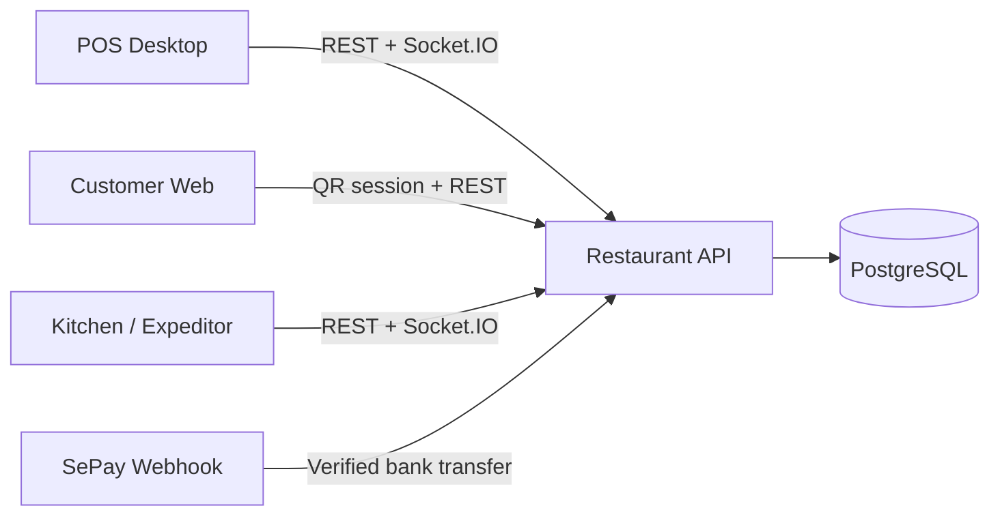

<div align="center">

# Maison Lucas Restaurant API

**The transactional core for ordering, table service, kitchen operations, payments and reporting.**


</div>

---

## Overview

This repository provides the REST and real-time backend shared by the Maison Lucas POS, customer ordering web application and kitchen/expeditor display. It centralises business rules so prices, availability, table sessions, order status and payment records remain consistent across every client.

## System context



## Core capabilities

| Domain | Responsibilities |
|---|---|
| Identity and access | JWT authentication, active-account checks, RBAC and staff impersonation audit support |
| Tables | Zones, permanent table QR identities, open-table sessions and transfers |
| Ordering | Staff/customer orders, item lifecycle, special requests, allergens and serving sequence |
| Menu | Categories, daily availability, sold-out rules and inventory-linked recipes |
| Kitchen | Station routing, expeditor lifecycle, event logs and completed bill history |
| Payments | Cash, card, bank transfer, vouchers, discounts, VAT and service charge |
| Operations | Business day, cash movements, shifts, receipts and management reports |
| Reliability | Rate limiting, idempotent mutation replay, request validation and transactional persistence |

## Technology

- Node.js and Express 5
- PostgreSQL with Sequelize ORM
- Socket.IO for operational updates
- JSON Web Tokens and bcrypt for authentication
- Jest and Supertest for automated tests
- Swagger UI in non-production environments
- Docker and Railway-compatible deployment configuration

## Local setup

### 1. Requirements

- Node.js 22 or later
- npm 11 or later
- PostgreSQL 15 or later, or Docker Desktop

### 2. Configure the environment

```bash
cp .env.example .env
```

Update the PostgreSQL credentials and generate a unique `JWT_SECRET` containing at least 48 characters. Never commit `.env`.

### 3. Install and run

```bash
npm install
npm run dev
```

The API is available at `http://localhost:5000/api`. Swagger documentation is available at `http://localhost:5000/api-docs` in development.

### Docker alternative

```bash
docker compose up --build
```

## Useful commands

| Command | Purpose |
|---|---|
| `npm run dev` | Start the API with automatic reload |
| `npm start` | Start the production server |
| `npm test` | Run all Jest suites serially |
| `npm run test:coverage` | Generate test coverage |
| `npm run import:data` | Import menu, table and inventory CSV data |
| `npm run import:vouchers` | Import voucher definitions |
| `npm run sync:roles` | Synchronise role permissions |

## Repository structure

```text
src/
├── config/       Database, environment and Swagger configuration
├── controllers/  HTTP request handlers
├── middleware/   Authentication, validation, rate limit and idempotency
├── models/       Sequelize entities and associations
├── routes/       REST route composition
├── services/     Reusable business operations
└── utils/        Imports, migrations and operational helpers
tests/            Unit and integration tests
```

## Related repositories

- [POS Desktop](https://github.com/BeoGTSDev/restaurant-system-fe-pos)
- [Customer Ordering Web](https://github.com/BeoGTSDev/restaurant-system-fe-csweb)
- [Kitchen / Expeditor](https://github.com/BeoGTSDev/restaurant-system-fe-backoffice)

## Security

Secrets belong only in local or deployment environment variables. Rotate any credential that has ever been committed, restrict production CORS origins, enable database TLS and configure a verified `SEPAY_WEBHOOK_SECRET` before accepting real transfers.

